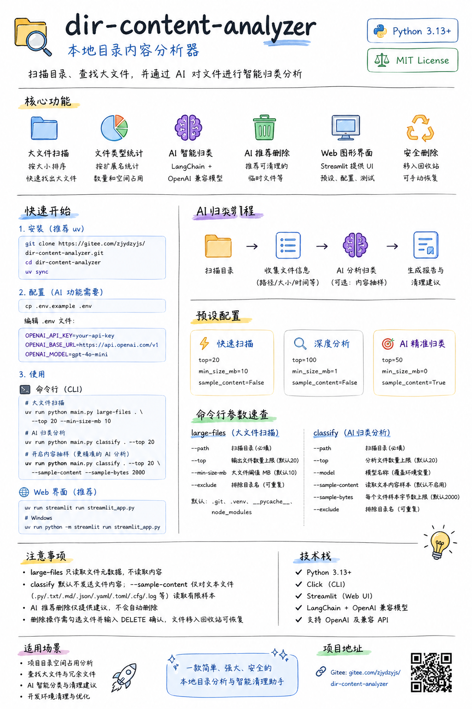
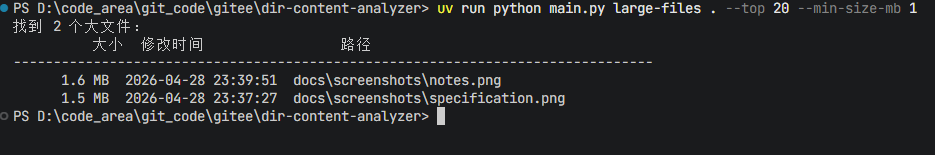
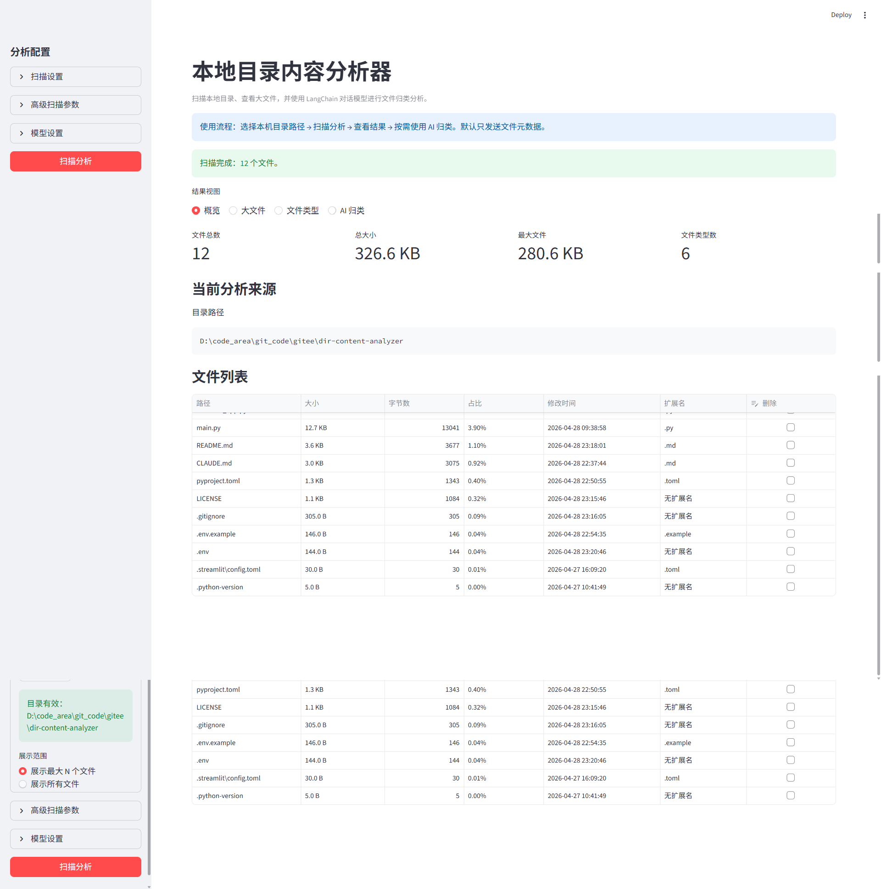
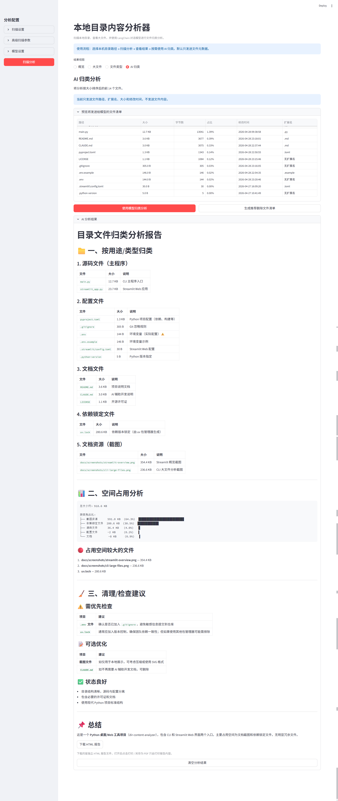
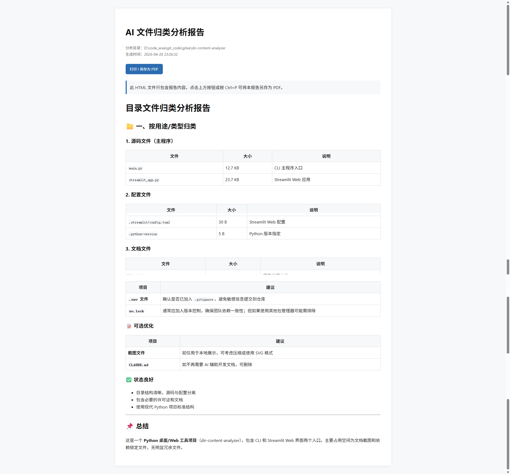
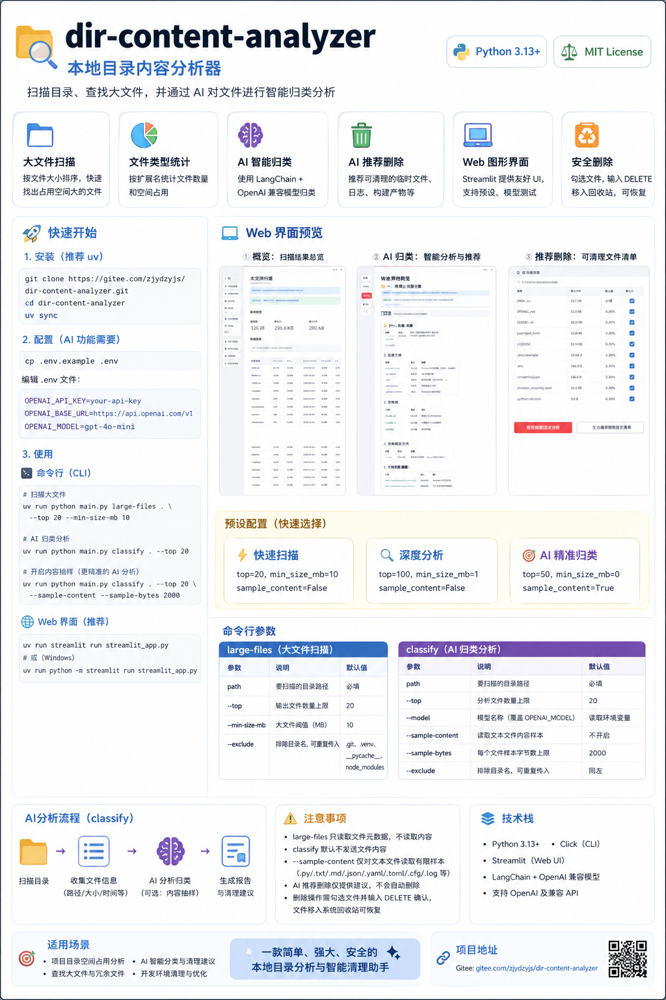

# 📂 dir-content-analyzer

### **智能本地目录分析与清理助手**

[](LICENSE)
[](https://www.python.org/)
[](https://gitee.com/zjydzyjs/dir-content-analyzer)

`dir-content-analyzer` 是一款结合了传统扫描技术与大语言模型（LLM）的目录管理工具。它不仅能帮你找出占用空间的“大户”，还能通过 AI 深度理解文件用途，提供语义化的归类与清理建议。

---

## 📝 核心设计思路

这是项目的原型设计与学习笔记，展示了从大文件扫描到 AI 智能归类的核心逻辑：



---

## ✨ 功能特性

* 🔍 **大文件扫描**：快速扫描目录并按文件大小排序，精准定位空间占用。
* 📊 **文件类型统计**：按扩展名统计文件数量和空间分布，项目结构一目了然。
* 🤖 **AI 智能归类**：使用 LangChain + OpenAI 兼容模型，对文件进行深度语义分析。
* 💡 **AI 推荐删除**：智能识别临时文件、日志、构建产物等可清理冗余。
* 🌐 **双界面支持**：提供高效的命令行（CLI）和友好的 Web 图形界面（Streamlit）。
* 🛡️ **安全删除机制**：选中文件进入系统回收站，支持手动恢复，确保数据安全。

---

## 🚀 快速开始

### 1. 安装驱动 (推荐使用 uv)
```bash
# 克隆仓库
git clone https://gitee.com/zjydzyjs/dir-content-analyzer.git
cd dir-content-analyzer

# 同步依赖
uv sync
```

### 2. 配置 AI (可选)
如果需要启用 `classify` 子命令或 Web 端的 AI 功能，请配置 `.env`：
```bash
cp .env.example .env
# 编辑 .env 填写 OpenAI 兼容的 API Key 与 Model 名称
```

---

## 📸 运行效果预览

### **命令行界面 (CLI)**
通过简单的指令快速获取大文件清单：


### **浏览器图形界面 (Web UI)**
运行 `uv run streamlit run streamlit_app.py` 开启可视化分析体验：

* **统计概览**：实时展示文件总数、总大小及最大文件分布。
    

* **AI 归类分析**：一键生成结构化的文件归类报告。
    

* **导出报告**：支持将分析结果生成 HTML 并打印为 PDF 存档。
    

---

## ⚙️ 参数与预设

项目内置了三种针对不同场景的预设配置，平衡扫描速度与分析深度：

| 预设名称 | 分析文件数 (top) | 大文件阈值 (MB) | 开启内容抽样 |
|----------|-----|-------------|----------------|
| **快速扫描** | 20 | 10 | ❌ 否 |
| **深度分析** | 100 | 1 | ❌ 否 |
| **AI 精准归类** | 50 | 0 | ✅ 是 |

---

## 📋 功能规格说明书

更详细的参数说明、技术栈及注意事项请参考下表：



---

## 🛠️ 技术栈

* **核心语言**: Python 3.13+
* **命令行框架**: Click (CLI)
* **Web 框架**: Streamlit
* **AI 框架**: LangChain + OpenAI 兼容模型
* **包管理**: uv

---

## 📄 许可证

本项目基于 [MIT License](LICENSE) 开源。
